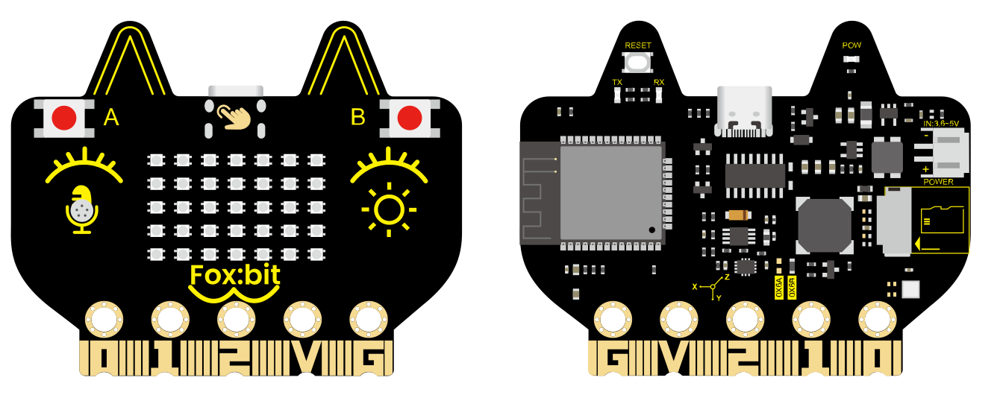
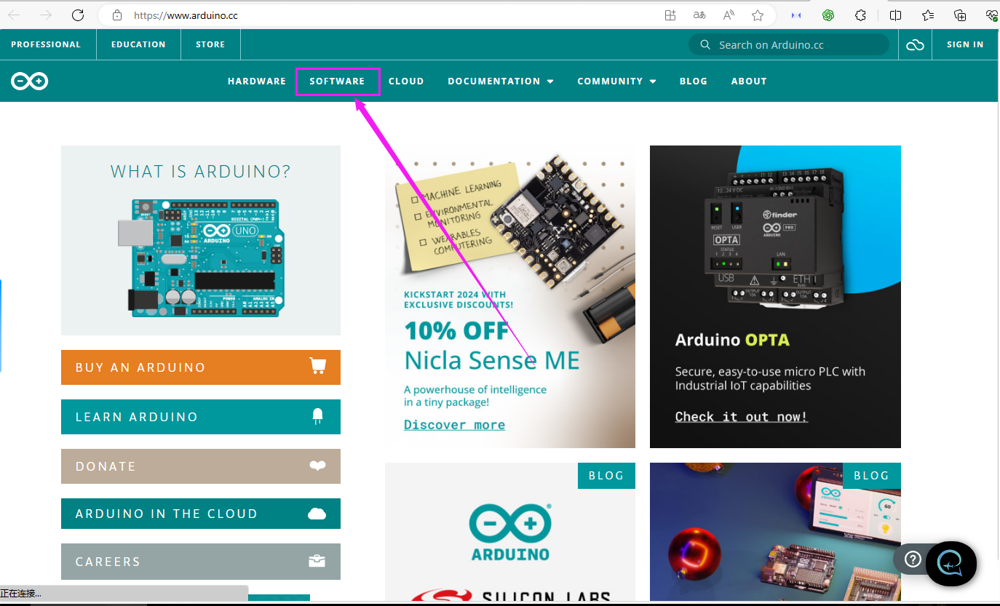
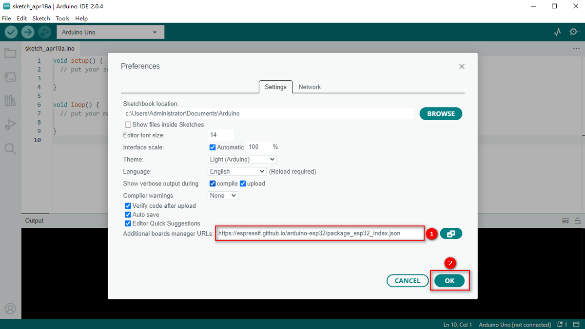
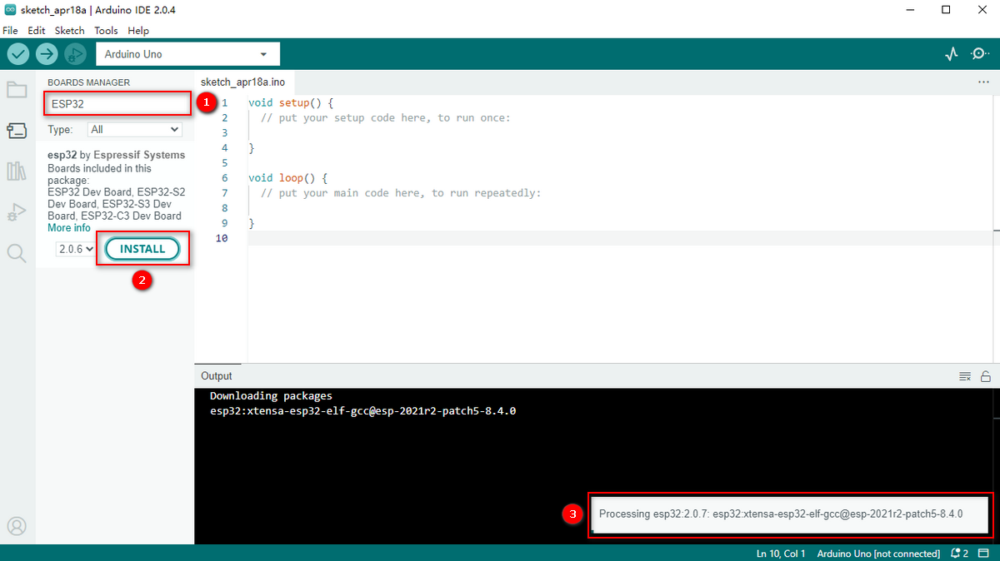

# **FoxBit Development Board User Manual**

## **1. Introduction**



The **FoxBit** is a multi-functional development board based on the ESP32 core, designed for education, makers, and electronics enthusiasts. It's suitable for various scenarios including Internet of Things (IoT), STEAM education, smart control, and DIY projects. It integrates a powerful ESP32 microcontroller chip, supports dual-mode communication via Wi-Fi and Bluetooth, offers high performance and low power consumption, and provides a rich set of peripherals to meet diverse needs from beginners to professional developers.

## **2. Features**

-   **High-Performance Microcontroller:** ESP32 dual-core processor, 240MHz, with 520KB SRAM and 4MB Flash, supports FreeRTOS.
-   **Wireless Communication:** Supports Wi-Fi (802.11 b/g/n) and Bluetooth (BLE and audio transmission).
-   **Rich Sensor and Peripheral Modules:** Includes a temperature and humidity sensor, six-axis accelerometer and gyroscope, light sensor, microphone, buzzer, and a 5x7 RGB LED dot matrix display.
-   **Strong Expandability:** Offers 19 digital I/O, 7 touch pins, 2 DACs, and 13 PWM outputs.
-   **Low Power Design:** Suitable for low-power applications powered by batteries.

## **3. Technical Specifications**

### **3.1 Power Supply**

-   **Power Supply Methods:**
    -   USB Power
    -   DC Power (PH2.0 connector)
    -   Power Supply via Golden Finger I/O ports
-   **Operating Voltage:** 3.3V
-   **Maximum Operating Current:** 1000mA (all LEDs lit)

### **3.2 Microcontroller**

-   **Chip Model:** ESP32-D0WDQ6 (dual-core processor)
-   **Clock Speed:** Up to 240MHz
-   **SRAM:** 520KB
-   **Flash:** 4MB

### **3.3 Wireless Communication**

-   **Wi-Fi:**
    -   Protocol: 802.11 b/g/n (supports 802.11n with a maximum speed of 150 Mbps)
    -   Operating Frequency Range: 2412 ~ 2484 MHz
-   **Bluetooth:**
    -   Protocol: Compliant with Bluetooth v4.2 BR/EDR and BLE standards
    -   Audio: Supports CVSD and SBC audio

### **3.4 On-board Resources**

| **Module**            | **Description**                   | **Interface Type** | **GPIO Pins**                                   |
|-----------------------|-----------------------------------|---------------------|-------------------------------------------------|
| **Button A**          | Digital Button A                   | Digital Interface    | GPIO0                                           |
| **Button B**          | Digital Button B                   | Digital Interface    | GPIO4                                           |
| **Touch Function**    | Touch Button                       | Touch Interface      | GPIO27                                          |
| **Six-Axis Accelerometer** | QMI8658C for motion detection and attitude awareness | I2C            | SDA: GPIO21 SCL: GPIO22                         |
| **Light Sensor**      | Phototransistor that detects ambient light intensity | Analog Interface | GPIO39                                          |
| **Microphone**        | Sound Detection                   | Analog Interface     | GPIO35                                          |
| **Buzzer**            | Plays sounds or music             | Digital Interface    | GPIO33                                          |
| **5x7 RGB LED Dot Matrix** | 35 WS2812 RGB LEDs, single wire control  | Digital Interface | GPIO13                                          |
| **Temperature & Humidity Sensor** | AHT20 for real-time monitoring | I2C         | SDA: GPIO21 SCL: GPIO22                         |
| **SD Card Expansion Interface** | SPI interface for storage expansion | SPI          | CS: GPIO5 MOSI: GPIO23 MISO: GPIO19 SCK: GPIO18 |
| **Current Detection** | Detects current                   | Analog Interface     | GPIO36                                          |


## **4. Application Scenarios**

The Foxbit development board is suitable for the following scenarios:

**Internet of Things (IoT) Projects**  
Connect devices via Wi-Fi or Bluetooth, perfect for smart home, environmental monitoring, and remote control applications.

**STEAM Education**  
Integrates various sensors and peripheral modules, ideal for teaching experiments and maker education, helping students quickly get started with hardware development.

**Smart Control**  
Supports a variety of input and output interfaces, can be used for robot control, automation device development, etc.

**DIY Projects**  
Rich onboard resources and expansion interfaces are perfect for makers and electronics enthusiasts to develop personalized projects.

## **5. Development Environment Support**

The Foxbit development board is compatible with various development environments, supporting quick development and debugging:

**Arduino IDE**  
Great for beginners, offering a wealth of libraries and example codes for quick development.

**MicroPython**  
Supports Python programming, suitable for rapid prototype development, with a simple syntax that's easy to learn.

**Other development environments will be updated successively.**

### **Using Arduino IDE to Develop FoxBit**

#### **1. Install the Arduino Development Environment**

##### **1.1 Install Arduino IDE**

1.  Visit the [Arduino official website](https://www.arduino.cc/en/software) to download Arduino IDE.
2.  Install Arduino IDE based on your operating system (Windows, macOS, or Linux).  
    

##### **1.2 Install ESP32 Board Support**

1.  Open Arduino IDE.
2.  Click on **File > Preferences**.
3.  In the "Additional Board Manager URLs" section, paste the following link:

```
https://raw.githubusercontent.com/espressif/arduino-esp32/gh-pages/package_esp32_index.json
```

  

4.  Click **OK** to save the settings.  
5.  Click on **Tools > Board > Board Manager**.  
  

6.  In the search box, type **ESP32**.  
7.  Find **esp32 by Espressif Systems**, then click **Install**.  


##### **1.3 Select the Development Board**

1.  Connect the Foxbit development board to your computer using a USB cable.
2.  In Arduino IDE, click on **Tools > Board > ESP32 Arduino**, and select **ESP32 Dev Module** (or similar ESP32 development board).  
    
3.  Click on **Tools > Port**, and select the COM port corresponding to the Foxbit development board.  
    

#### **2. Module Functions and Application Examples**

##### **2.1 Buttons A and B**

**Description**

-   **Button A**: Digital button connected to GPIO0.
-   **Button B**: Digital button connected to GPIO4.
-   Used for user input, such as controlling device power or switching modes.

**Example Code: Detect Button States**  
This code checks the pressed state of Buttons A and B, and prints the result to the serial monitor.

```cpp
#define BUTTON_A 0 // Button A pin
#define BUTTON_B 4 // Button B pin

void setup() {
    pinMode(BUTTON_A, INPUT_PULLUP); // Set Button A as input with internal pull-up resistor
    pinMode(BUTTON_B, INPUT_PULLUP); // Set Button B as input with internal pull-up resistor
    Serial.begin(115200); // Initialize serial communication
}

void loop() {
    if (digitalRead(BUTTON_A) == LOW) {
        Serial.println("Button A Pressed");
    }
    if (digitalRead(BUTTON_B) == LOW) {
        Serial.println("Button B Pressed");
    }
    delay(100); // Prevent repeated detection
}
```

##### **2.2 Touch Functionality**

**Description**

-   Touch button connected to GPIO27.
-   Can be used for touch interaction, like switching controls or sliding detection.

**Example Code: Detect Touch Input**  
This code detects the touch state of the button and prints the result to the serial monitor.

```cpp
#define TOUCH_PIN 27 // Touch button pin

void setup() {
    Serial.begin(115200); // Initialize serial communication
    touchAttachInterrupt(TOUCH_PIN, onTouch, 40); // Set touch interrupt with a threshold of 40
}

void loop() {
    delay(100); // No operations needed in the main loop, touch events are handled by interrupts
}

void onTouch() {
    Serial.println("Touch Detected!");
}
```

##### **2.3 Six-Axis Accelerometer**

**Description**

-   QMI8658C for motion detection and attitude awareness, using I2C interface (SDA: GPIO21, SCL: GPIO22).
-   Can detect acceleration and angular velocity, suitable for motion detection and posture recognition applications.

**Example Code: Read Acceleration and Gyroscope Data**  
This code reads acceleration and gyroscope data using the QMI8658C library.

```cpp
#include <Wire.h>
#include "QMI8658.h"
QMI8658 qmi8658;
void setup() 
{
  Serial.begin(115200);   // Initialize serial communication
  Wire.begin(21,22);           // Initialize I2C
  if( qmi8658.begin()== 0)
  {
    Serial.println("qmi8658_init fail");
  }
}
void loop() 
{
  QMI8658_Test();    
}
void QMI8658_Test()
{
  float pitch;
  float roll;
  float yaw;
  qmi8658.GetEulerAngles(&pitch,&roll, &yaw);
  Serial.print(pitch );Serial.print(" , " );
  Serial.print(roll );Serial.print(" , " );
  Serial.println(yaw );
}
```

##### **2.4 Light Sensor**

**Description**

-   ALS-PT19-315C phototransistor connected to GPIO39 (analog interface).
-   Used for detecting ambient light intensity, suitable for automatic brightness adjustment and light detection.

**Example Code: Read Light Intensity Values**  
This code reads the analog value from the light sensor and prints the result to the serial monitor.

```cpp
#define LIGHT_SENSOR_PIN 39 // Light sensor pin

void setup() {
    Serial.begin(115200); // Initialize serial communication
}

void loop() {
    int lightValue = analogRead(LIGHT_SENSOR_PIN); // Read light intensity value
    Serial.print("Light Intensity: ");
    Serial.println(lightValue);
    delay(500);
}
```

##### **2.5 Microphone**

**Description**

-   Used for sound detection, connected to GPIO35 (analog interface).
-   Suitable for voice recognition and noise monitoring.

**Example Code: Detect Sound Intensity**  
This code reads the analog value from the microphone and prints the sound intensity.

```cpp
#define MIC_PIN 35 // Microphone pin

void setup() {
    Serial.begin(115200); // Initialize serial communication
}

void loop() {
    int soundValue = analogRead(MIC_PIN); // Read sound intensity value
    Serial.print("Sound Intensity: ");
    Serial.println(soundValue);
    delay(500);
}
```

##### **2.6 Buzzer**

**Description**

-   Used for playing sounds or music, connected to GPIO33 (digital interface).

**Example Code: Play Music**  
This code uses the buzzer to play a simple tune (like "Twinkle, Twinkle Little Star").

```cpp
#define BUZZER_PIN 33 // Buzzer pin

// Define note frequencies (in Hz)
#define NOTE_C4 262
#define NOTE_D4 294
#define NOTE_E4 330
#define NOTE_F4 349
#define NOTE_G4 392
#define NOTE_A4 440
#define NOTE_B4 494
#define NOTE_C5 523

// Define note durations (in milliseconds)
#define WHOLE_NOTE 1000
#define HALF_NOTE 500
#define QUARTER_NOTE 250
#define EIGHTH_NOTE 125

// Define melody notes and rhythm for "Twinkle, Twinkle"
int melody[] = {
    NOTE_C4, NOTE_C4, NOTE_G4, NOTE_G4, NOTE_A4, NOTE_A4, NOTE_G4,
    NOTE_F4, NOTE_F4, NOTE_E4, NOTE_E4, NOTE_D4, NOTE_D4, NOTE_C4
};

int noteDurations[] = {
    QUARTER_NOTE, QUARTER_NOTE, QUARTER_NOTE, QUARTER_NOTE, QUARTER_NOTE, QUARTER_NOTE, HALF_NOTE,
    QUARTER_NOTE, QUARTER_NOTE, QUARTER_NOTE, QUARTER_NOTE, QUARTER_NOTE, QUARTER_NOTE, HALF_NOTE
};

void setup() {
    pinMode(BUZZER_PIN, OUTPUT); // Set buzzer as output
}

void loop() {
    // Play "Twinkle, Twinkle"
    for (int i = 0; i < sizeof(melody) / sizeof(melody[0]); i++) {
        int noteDuration = noteDurations[i];
        tone(BUZZER_PIN, melody[i], noteDuration); // Play the note
        delay(noteDuration * 1.3); // Delay to ensure a gap between notes
        noTone(BUZZER_PIN); // Stop the current note
    }
    delay(2000); // Wait 2 seconds after playing
}
```

##### **2.7 RGB LED Dot Matrix**

**Description**

-   35 WS2812-2020 RGB LEDs, single wire control, connected to GPIO13.
-   Can be used to display colors, animations, and scrolling text.

**Example Code: Light Up the RGB LED Dot Matrix**  
This code lights up the RGB LED dot matrix and cycles through different colors.

```cpp
#include <Adafruit_NeoPixel.h>

#define LED_PIN 13 // RGB LED dot matrix pin
#define NUM_LEDS 35 // Total number of LEDs in the matrix
#define MATRIX_WIDTH 5 // Width of the matrix (columns)
#define MATRIX_HEIGHT 7 // Height of the matrix (rows)

Adafruit_NeoPixel strip(NUM_LEDS, LED_PIN, NEO_GRB + NEO_KHZ800);

// Convert 2D coordinates (x, y) to a 1D LED index
int getLedIndex(int x, int y) {
    if (y % 2 == 0) { // Even rows from left to right
        return y * MATRIX_WIDTH + x;
    } else { // Odd rows from right to left
        return y * MATRIX_WIDTH + (MATRIX_WIDTH - 1 - x);
    }
}

void setup() {
    strip.begin();
    strip.show(); // Initialize all LEDs to off
}

void loop() {
    // Cycle through lighting each LED
    for (int y = 0; y < MATRIX_HEIGHT; y++) {
        for (int x = 0; x < MATRIX_WIDTH; x++) {
            int index = getLedIndex(x, y);
            strip.setPixelColor(index, strip.Color(255, 0, 0)); // Set to red
            strip.show();
            delay(100);
        }
    }
    delay(500);
    // Clear all LEDs
    strip.clear();
    strip.show();
    delay(500);
}
```

##### **2.8 Temperature and Humidity Sensor**

**Description**

-   AHT20 for real-time monitoring, uses I2C interface (SDA: GPIO21, SCL: GPIO22).
-   Monitors ambient temperature and humidity.

**Example Code: Read Temperature and Humidity Data**  
This code reads data from the temperature and humidity sensor.

```cpp
#include <Wire.h>
#include <Adafruit_AHTX0.h>

Adafruit_AHTX0 aht;

void setup() {
    Serial.begin(115200);
    if (!aht.begin()) {
        Serial.println("Failed to initialize AHT20!");
        while (1);
    }
}

void loop() {
    sensors_event_t humidity, temp;
    aht.getEvent(&humidity, &temp);
    Serial.print("Temperature: ");
    Serial.print(temp.temperature);
    Serial.println(" °C");
    Serial.print("Humidity: ");
    Serial.print(humidity.relative_humidity);
    Serial.println(" %");
    delay(1000);
}
```

##### **2.9 SD Card Expansion Interface**

**Description**

-   SPI interface for storage expansion.

**Example Code: Read and Write SD Card Files**  
This code demonstrates reading and writing files with the SD card module.

```cpp
#include <SPI.h>
#include <SD.h>

#define CS_PIN 5 // SD card CS pin

void setup() {
    Serial.begin(115200);
    // Initialize SD card
    if (!SD.begin(CS_PIN)) {
        Serial.println("SD card initialization failed!");
        while (1);
    }
    Serial.println("SD card initialized successfully!");
    // Create and write to file
    File file = SD.open("/test.txt", FILE_WRITE);
    if (file) {
        file.println("Hello, SD Card!");
        file.close();
        Serial.println("File written successfully!");
    } else {
        Serial.println("Unable to open file for writing!");
    }

    // Read file content
    file = SD.open("/test.txt");
    if (file) {
        Serial.println("File content:");
        while (file.available()) {
            Serial.write(file.read());
        }
        file.close();
    } else {
        Serial.println("Unable to open file for reading!");
    }
}

void loop() {
    // Empty loop
}
```

##### **2.10 Power Detection Module**

**Description**

-   Power detection module (INA180A1IDBVR) detects supply current via an analog interface (GPIO36).
-   Can monitor the power supply current or voltage.

**Example Code: Read Power Supply Current**  
This code reads the analog value from the power detection module and converts it to voltage.

```cpp
#define POWER_SENSOR_PIN 36 // Power detection module pin  
#define SENSITIVITY 0.1      // Sensitivity in A/V (100 mV/A)  

void setup() {  
    Serial.begin(115200);  
    // Initialize ADC  
    analogReadResolution(12); // Set ADC resolution to 12 bits  
    analogSetAttenuation(ADC_11db); // Set range to 0-3.3V  
}  

void loop() {  
    int rawValue = analogRead(POWER_SENSOR_PIN); // Read ADC raw value  
    float voltage = rawValue * (3.3 / 4095.0); // Convert ADC value to voltage  
    float current = voltage / SENSITIVITY; // Convert voltage to current (A)  
    
    // Convert current from A to mA  
    current *= 1000;  

    Serial.print("Current: ");  
    Serial.print(current);  
    Serial.println(" mA");  
    delay(100);  
}  
```

### **Developing with MicroPython on Foxbit**

#### **1. What is MicroPython?**

MicroPython is a lightweight implementation of Python designed for microcontrollers. It supports various development boards (like ESP32, micro:bit, etc.) and provides rich hardware control libraries, ideal for rapid development and learning.

#### **2. Download and Install Thonny**

##### **Download Thonny**

1.  Open the official website: <https://thonny.org>.
2.  Choose the version based on your operating system:
    -   **Windows**: [thonny-3.2.7.exe](https://github.com/thonny/thonny/releases/download/v3.2.7/thonny-3.2.7.exe)
    -   **macOS**: [thonny-3.2.7.pkg](https://github.com/thonny/thonny/releases/download/v3.2.7/thonny-3.2.7.pkg)
    -   **Linux**:

        ```
        sudo apt install thonny # For Debian/Ubuntu systems
        ```

##### **Install Thonny**

1.  Double-click the downloaded installation file (e.g., thonny-3.3.13.exe).  
    

2.  Click **Next** in the installation wizard and choose the installation path if needed.  
    

3.  Check **Create desktop icon** to create a shortcut.  
    

4.  Click **Install** and wait for the installation to complete.  
    

5.  Click **Finish** when done.  
    

##### **Launch Thonny**

1.  Double-click the Thonny icon on your desktop.
2.  For the first startup, select your language and initial settings, then click **Let’s go!**.  
    

#### **3. Flash MicroPython Firmware**

##### **Connect ESP32**

1.  Use a USB cable to connect the ESP32 development board to your computer.
2.  Open **Device Manager**, expand **Ports (COM & LPT)**, and confirm the board's COM port (e.g., USB-SERIAL CH340 (COM283)).  
    

##### **Open Thonny**

1.  Launch Thonny IDE.
2.  Go to the **Run** menu and select **Select interpreter...**.  
    

##### **Install or Update Firmware**

1.  Firmware download link: <https://micropython.org/resources/firmware/esp32-20210902-v1.17.bin>
2.  In the interpreter settings:
    -   Select **MicroPython (ESP32)**.
    -   Choose the corresponding COM port (e.g., USB-SERIAL CH340 (COM283)).
    -   Click **Install or update firmware**.  
        
3.  In the firmware installation window:
    -   Select the COM port (e.g., USB-SERIAL CH340 (COM283)).
    -   Click **Browse...** to choose the downloaded firmware file (e.g., esp32-20210902-v1.17.bin).
    -   Check **Erase flash before installing** and **Flash mode**.
    -   Click **Install** to begin flashing.  
        
4.  After flashing, click **Close** and then **OK**.

##### **Return to Main Interface**

1.  Close all settings windows to return to Thonny's main interface.
2.  Click the **STOP** button on the main interface to ensure the board is ready to run code.  
    

#### **4. Test MicroPython Environment**

##### **Open Shell**

1.  In Thonny, ensure the **Shell** view is enabled (click **View > Shell**).
2.  If connected successfully, the Shell should display the >>> prompt.  
    

##### **Test Code**

Type the following code in the Shell:

```python
print("Hello, MicroPython!")
```

If the message is printed successfully, it indicates the environment is set up correctly.

#### **5. Upload Code to Foxbit**

1.  Write code in Thonny.
2.  Click **File > Save As**, select **MicroPython Device**, and save the code to the ESP32.

#### **6. Module Functions and MicroPython Examples**

##### **2.1 Buttons A and B**

**Description**

-   **Button A**: Digital button connected to GPIO0.
-   **Button B**: Digital button connected to GPIO4.
-   Used for user input, controlling device power or mode switching.

**MicroPython Example: Detect Button States**

```python
from machine import Pin
import time

button_a = Pin(0, Pin.IN, Pin.PULL_UP) # Button A
button_b = Pin(4, Pin.IN, Pin.PULL_UP) # Button B

while True:
    if not button_a.value(): # Button A pressed
        print("Button A Pressed")
    if not button_b.value(): # Button B pressed
        print("Button B Pressed")
    time.sleep(0.1)
```

##### **2.2 Touch Functionality**

**Description**

-   Touch button connected to GPIO27.
-   Can be used for touch interaction, like switching controls or sliding detection.

**MicroPython Example: Detect Touch Input**

```python
from machine import TouchPad, Pin
import time

touch = TouchPad(Pin(27)) # Initialize touch pin

while True:
    touch_value = touch.read() # Read touch value
    if touch_value < 500: # Determine touch based on threshold
        print("Touch Detected")
    else:
        print("No Touch Detected")
    time.sleep(0.1)
```

##### **2.3 Six-Axis Accelerometer**

**Description**

-   QMI8658C for motion detection and attitude awareness.
-   Uses I2C interface.

**MicroPython Example: Read Acceleration Data**

```python
from machine import I2C, Pin
import time

i2c = I2C(0, scl=Pin(22), sda=Pin(21)) # Initialize I2C

# QMI8658C I2C address
QMI8658C_ADDR = 0x6A

# Initialize the sensor
i2c.writeto_mem(QMI8658C_ADDR, 0x02, b'\x01') # Set operational mode

while True:
    # Read acceleration data
    accel_data = i2c.readfrom_mem(QMI8658C_ADDR, 0x35, 6)
    ax = int.from_bytes(accel_data[0:2], 'little', signed=True)
    ay = int.from_bytes(accel_data[2:4], 'little', signed=True)
    az = int.from_bytes(accel_data[4:6], 'little', signed=True)
    print("Acceleration X: {}, Y: {}, Z: {}".format(ax, ay, az))
    time.sleep(0.5)
```

##### **2.4 Light Sensor**

**Description**

-   ALS-PT19-315C phototransistor for detecting ambient light intensity.
-   Uses analog interface.

**MicroPython Example: Read Light Intensity**

```python
from machine import ADC, Pin
import time

light_sensor = ADC(Pin(39)) # Initialize light sensor
light_sensor.atten(ADC.ATTN_11DB) # Set range to 0-3.3V

while True:
    light_value = light_sensor.read() # Read light intensity value
    print("Light Intensity: {}".format(light_value))
    time.sleep(0.5)
```

##### **2.5 Microphone**

**Description**

-   Used for sound detection, connected to GPIO35.
-   Suitable for voice recognition and noise monitoring.

**MicroPython Example: Detect Sound Intensity**

```python
from machine import ADC, Pin
import time

mic = ADC(Pin(35)) # GPIO35
mic.atten(ADC.ATTN_11DB) # Set range to 0-3.3V

while True:
    mic_value = mic.read() # Read microphone analog value
    print("Sound Intensity: {}".format(mic_value))
    time.sleep(0.1)
```

##### **2.6 Buzzer**

**Description**

-   Used for playing sounds or music, connected to GPIO33.

**MicroPython Example: Play Music**

```python
from machine import Pin, PWM
import time

buzzer = PWM(Pin(33)) # Initialize buzzer

# Define note frequencies
tones = {
    "C4": 262,
    "D4": 294,
    "E4": 330,
    "F4": 349,
    "G4": 392,
    "A4": 440,
    "B4": 494,
    "C5": 523
}

# Define melody notes and rhythm for "Twinkle, Twinkle"
melody = ["C4", "C4", "G4", "G4", "A4", "A4", "G4",
    "F4", "F4", "E4", "E4", "D4", "D4", "C4"]
duration = [0.5, 0.5, 0.5, 0.5, 0.5, 0.5, 1,
    0.5, 0.5, 0.5, 0.5, 0.5, 0.5, 1]

for note, dur in zip(melody, duration):
    buzzer.freq(tones[note]) # Set pitch
    buzzer.duty(512) # Set volume
    time.sleep(dur) # Duration
    buzzer.duty(0) # Stop buzzer
    time.sleep(0.1)
```

##### **2.7 RGB LED Dot Matrix**

**Description**

-   35 WS2812-2020 RGB LEDs, single wire control.
-   Supports displaying various colors and dynamic effects.

**MicroPython Example: Light Up RGB LEDs**

```python
from machine import Pin
import neopixel
import time

np = neopixel.NeoPixel(Pin(13), 35) # Initialize RGB LED dot matrix

# Light up all LEDs in red
for i in range(35):
    np[i] = (255, 0, 0) # Red
np.write()
```

##### **2.8 Temperature and Humidity Sensor**

**Description**

-   AHT20 for real-time monitoring, uses I2C interface.

**MicroPython Example: Read Temperature and Humidity**

```python
from machine import I2C, Pin
import time
import ahtx0

i2c = I2C(0, scl=Pin(22), sda=Pin(21)) # Initialize I2C
sensor = ahtx0.AHT20(i2c)

while True:
    print("Temperature: {:.2f} °C, Humidity: {:.2f} %".format(sensor.temperature, sensor.relative_humidity))
    time.sleep(1)
```

##### **2.9 SD Card Expansion Interface**

**Description**

-   SPI interface for storage expansion.

**MicroPython Example: Read and Write SD Card**

```python
import os
from machine import Pin, SPI, SDCard

spi = SPI(2, sck=Pin(18), mosi=Pin(23), miso=Pin(19))
sd = SDCard(spi, cs=Pin(5))
os.mount(sd, "/sd")

with open("/sd/test.txt", "w") as f:
    f.write("Hello, SD Card!")
```

##### **2.10 Power Detection Module**

**Description**

-   Detects supply current.

**MicroPython Example: Detect Power Supply Current**

```python
from machine import ADC, Pin
import time

sensor = ADC(Pin(36))
sensor.atten(ADC.ATTN_11DB)

while True:
    value = sensor.read()
    print("Power Current: {}".format(value))
    time.sleep(1)
```


## **6. Related Links**

**[Download Code](Code.rar)**

**[Download Library](QMI8658.zip)**

**[Keyestudio Official Website](https://www.keyestudio.com)**
  
**[Arduino Official Website](https://www.arduino.cc)**

**[Espressif Official Website](https://www.espressif.com)**

**[PlatformIO Official Website](https://platformio.org/)**
  